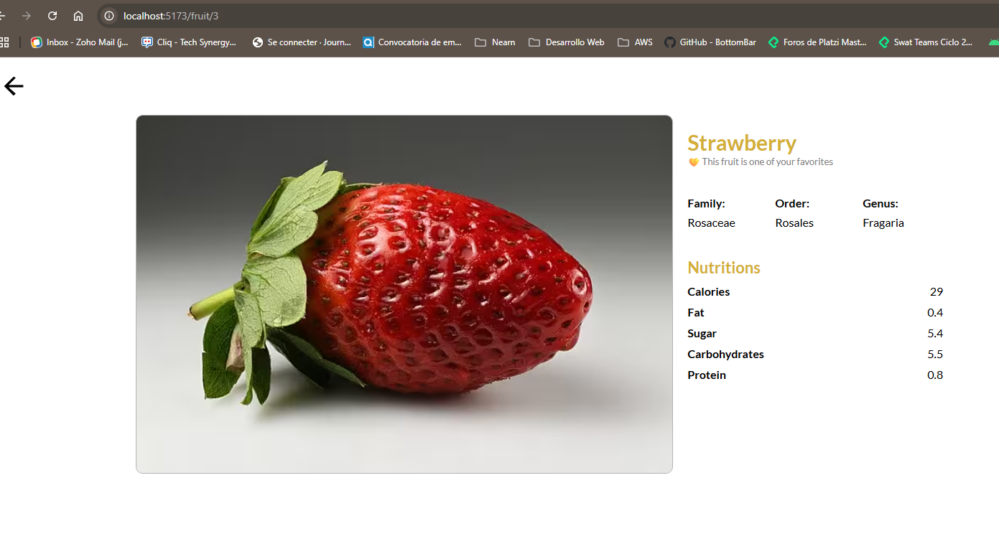

Season Fruit es una plataforma web que permite visualizar, buscar y filtrar tarjetas de frutas con su información nutricional. Con esto, se podrá demostrar la destreza que tiene el desarrollador Frontend al trabajar en proyectos con React + TypeScript + Vite.

# Tabla de Contenidos
- [Instalación](#instalación)
- [Uso](#uso)
- [Capturas de Pantalla](#capturas-de-pantalla)
- [Estructura del Proyecto](#estructura-del-proyecto)
- [Tecnologías Utilizadas](#tecnologías-utilizadas)
- [Visitar Pagina](#visitar-pagina)


# Instalación
Es importante seguir estos pasos para poder ejecutar la plataforma de manera local
En mi caso trabaje con npm

### Clonar el repositorio
git clone git@github.com:JairoRamirezC/Season-Fruits.git

### Navegar al directorio del proyecto
cd Season-fruits
npm install

### SASS
```npm install --save-dev node-sass``` Y/O ```npm install -D```

### React-Router-Dom
```npm i react-router-dom```

### Axios
```npm install axios```

### Material UI
```npm install @mui/material @emotion/react @emotion/styled @mui/icons-material```

# Uso
```npm run dev```

# Capturas de Pantalla



# Estructura del Proyecto
```plaintext
SEASON-FRUITS/
├── node_modules/
├── public/
├── src/
│   ├── assets/
│   │   └── fruits/
│   │       ├── icon/
│   │       └── images/
│   │
│   ├── common/
│   │   ├── routers/
│   │   │   └── RouterApp.tsx
│   │   ├── store/
│   │   │   └── useFilterStore.ts
│   │   ├── styles/
│   │   │   └── variables.scss
│   │   └── utils/
│   │       ├── helpers/
│   │       │   ├── ApiFruitsAxios.ts
│   │       │   └── FruitImageLoader.ts
│   │       └── types.ts
│   │
│   ├── components/
│   │   ├── filters/
│   │   │   ├── _filtersSection.scss
│   │   │   └── FiltersSection.tsx
│   │   ├── fruitCards/
│   │   │   ├── cards/
│   │   │   │   ├── _cards.scss
│   │   │   │   └── Cards.tsx
│   │   │   ├── _fruitCards.scss
│   │   │   └── FruitCards.tsx
│   │   ├── generalInformation/
│   │   └── skeleton/
│   │
│   ├── pages/
│   │   ├── detailsFruit/
│   │   │   ├── _detailsFruit.scss
│   │   │   └── DetailsFruit.tsx
│   │   └── fruits/
│   │       ├── _fruitPage.scss
│   │       └── FruitsPage.tsx
│   │
│   ├── main.tsx
│   └── vite-env.d.ts
│
├── .gitignore
├── eslint.config.js
├── index.html
├── package-lock.json
├── package.json
├── README.md
├── tsconfig.app.json
├── tsconfig.json
├── tsconfig.node.json
└── vite.config.ts
```
# Tecnologías Utilizadas
- React
- Typescript
- React Router Dom
- Axios
- Zustand
- Sass
- Material UI
- Vercel

# Visitar Pagina
[https://jairoramirezc.github.io/](https://jairoramirezc.github.io/MovieApp/)


DEV: Jairo Ramirez Castanio - @JairoRamirezC
